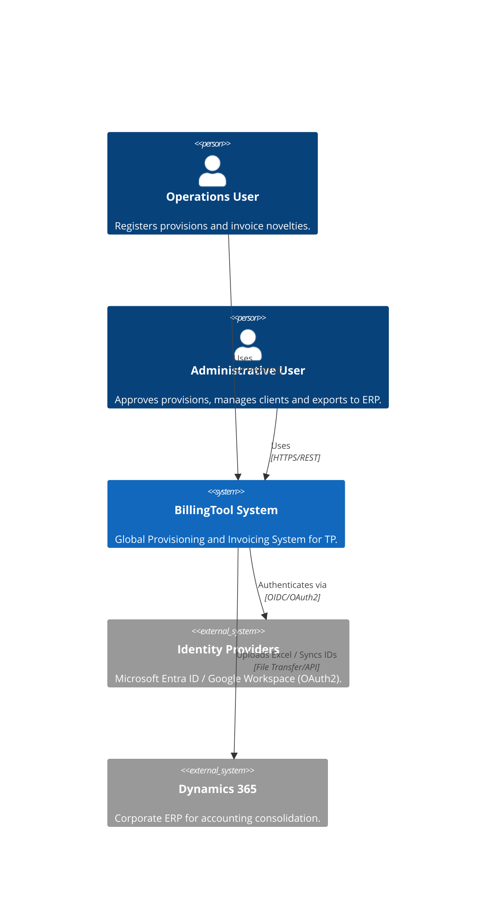
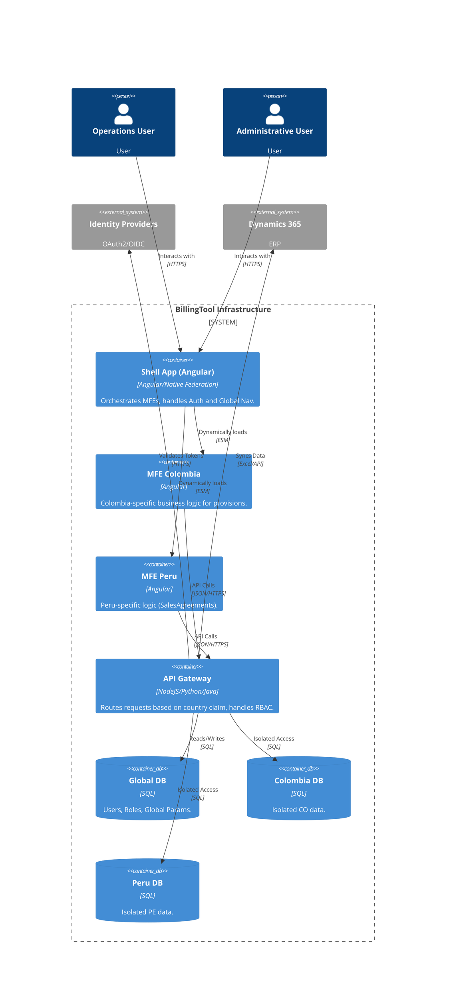
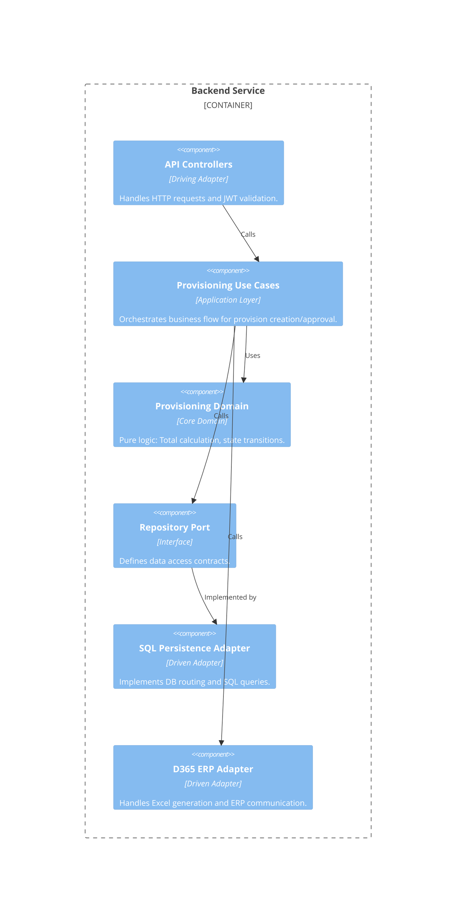

# System Architecture Definition Document (SADD) — ISO/IEC/IEEE 6.4.4 & ISO 24774

## 1. Process Definition (ISO 24774)

| Element | Description |
| :--- | :--- |
| **Name** | **Proceso de Definición de arquitectura para BillingTool** |
| **Purpose** | To define a high-performance, scalable, and robust technical structure that satisfies the global provisioning and invoicing requirements of TP, ensuring strict data isolation and agile delivery through a monorepo approach. |
| **Results** | 1. **Architecture Baseline:** Validated technical blueprint.<br>2. **Software Design Document (SDD):** Detailed design of Hexagonal layers.<br>3. **Infrastructure Map:** Deployment and CI/CD orchestration plan.<br>4. **Interface Contracts:** API and MFE federation specifications. |
| **Activities** | **A1: Domain Modeling:** Extraction of business entities and use cases from `requirementENG.md`.<br>**A2: Structural Design:** Definition of the Shell/MFE relationship and Backend Port/Adapter layers.<br>**A3: Quality & Tooling Definition:** Selection of static analysis and orchestration tools.<br>**A4: Validation:** Review against NFRs (Scalability, Isolation). |
| **Tasks** | **T1.1:** Design the Hexagonal Core for Provisioning and Invoicing.<br>**T1.2:** Implement Nx Graph for dependency management.<br>**T1.3:** Configure Native Federation for dynamic MFE loading.<br>**T1.4:** Define the Multi-tenant DB routing logic.<br>**T1.5:** Establish SonarQube quality gates. |
| **Constraints** | **C1: Data Isolation:** Physical/Logical separation of country DBs (NFR-04).<br>**C2: IdP Portability:** Support for MS Entra ID and Google Workspace (NFR-03).<br>**C3: ERP Integration:** Strict template compliance for Microsoft Dynamics 365. |
| **Notes** | Estamos implementando ISO/IEC/IEEE 12207 - 6.4.4 definición de arquitectura de software - 24774 de forma genérica con estandard internacional. |
| **Controls** | **Ctrl-1:** mandatory SonarQube "Pass" for all PRs.<br>**Ctrl-2:** Unit test coverage $\ge 80\%$ for the Core Domain.<br>**Ctrl-3:** Architectural linting via Nx to prevent circular dependencies. |

---

## 2. Software Design Document (SDD)

### 2.1. Architectural Vision: Hybrid Hexagonal & DDD Architecture
The system implements a **Hybrid Hexagonal Architecture** (Ports and Adapters) combined with **Domain-Driven Design (DDD)**. This ensures that the **Business Core** (Provisioning and Invoicing rules) is completely decoupled from external technologies, frameworks, and delivery mechanisms.

#### 2.1.1. The Hexagonal Layers & DDD Strategic Design
1.  **The Core (Domain):** Pure business logic based on DDD (Entities, Value Objects, Domain Services). Zero dependencies on frameworks.
2.  **The Application Layer (Use Cases):** Orchestrates the flow of data. Defines the "Ports" (Interfaces) for input and output.
3.  **The Infrastructure Layer (Adapters):**
    *   **Driving Adapters (Primary):** Angular MFE Shell, REST Controllers.
    *   **Driven Adapters (Secondary):** Django Persistence Adapters, D365 ERP Client, OAuth2 IdP.

---

### 2.2. Frontend Architecture (Enterprise Monorepo)

#### 2.2.1. Implementation Strategy: Angular + Nx + Native Federation
To achieve massive scalability, the frontend uses **Angular** for its strong typing and enterprise-grade structure, orchestrated by **Nx** and **Native Federation**.

**Architecture Components:**
*   **The Shell (Host):** The "Core" of the user experience. Handles authentication, global state, and the dynamic loading of remotes.
*   **Remote MFEs (mfe-co, mfe-pe):** Autonomous applications containing country-specific business rules (e.g., Peru's `SalesAgreement` logic).
*   **Shared Libraries:**
    *   `shared-domain`: Core models, localization, and business interfaces.
    *   `shared-infra`: UI Design System, common HTTP interceptors, and utilities.

#### 2.2.2. Frontend Hexagonal Mapping
| Hexagonal Layer | Frontend implementation |
| :--- | :--- |
| **Domain Core** | `shared-domain` (TypeScript Interfaces, Pure Logic) |
| **Application** | Angular Services / State Management (NgRx/Signals) |
| **Driving Adapters** | Angular Components / Pages / Routing |
| **Driven Adapters** | API Client Services (HTTP Interceptors $\rightarrow$ Backend API) |

---

### 2.3. Backend Architecture (Scalable Multi-tenant)

#### 2.3.1. Backend Hexagonal Structure with Django
The backend is implemented using **Django**, leveraging its "batteries-included" security philosophy. Django is selected for its industry-leading protection against common vulnerabilities (SQL Injection, XSS, CSRF) and its robust ORM.

1.  **Core Domain:** Pure business logic for calculating totals, validating novelties, and managing the transition from Provision $\rightarrow$ Invoice.
2.  **Application Ports:** Interfaces defining how the system interacts with DBs and external ERPs.
3.  **Infrastructure Adapters:**
    *   **Persistence Adapter:** Django-based routing logic that selects the DB connection based on the `country` claim in the JWT.
    *   **ERP Adapter:** Specialized client for generating and uploading Excel files to Dynamics 365.
    *   **Security Adapter:** Django Authentication combined with an abstraction layer for OAuth2 (MS Entra / Google).

#### 2.3.2. Data Isolation Model
To satisfy **NFR-04**, the architecture implements **Database-per-Tenant** (Physical Isolation):
`API Gateway` $\rightarrow$ `Tenant Resolver (JWT)` $\rightarrow$ `Dynamic DataSource Router` $\rightarrow$ `[DB_CO | DB_PE | DB_Global]`.

---

### 2.4. DevOps, Quality, and Orchestration Stack

To support **Rapid Development** and **Evolutionary Delivery**, the following ecosystem is integrated:

#### 2.4.1. Monorepo Orchestration (Nx)
*   **Nx Graph:** Used for visual dependency analysis. Ensures that `shared-domain` is never dependent on a specific `mfe`.
*   **Task Orchestration:** Use of `nx affected` to run tests and builds only for the modules modified in a PR, reducing CI time by up to 80%.
*   **Caching:** Distributed caching for build artifacts to accelerate developer onboarding.

#### 2.4.2. Quality Gates (The "Robustness" Layer)
*   **Static Analysis:** **SonarQube** integration in the CI pipeline. 
    *   *Gate:* No "Blocker" or "Critical" issues allowed.
    *   *Metric:* Cognitive complexity monitoring.
*   **Code Quality:** ESLint + Prettier enforced via pre-commit hooks (Husky).
*   **Engineering Paradigms:** 
    *   **TDD (Test-Driven Development):** Mandatory test-first approach for all Domain and Application services.
    *   **BDD (Behavior-Driven Development):** Use of Gherkin syntax to define acceptance criteria for MFEs.
    *   **DDD (Domain-Driven Design):** Strategic mapping of bounded contexts to prevent logic leakage between MFEs.
*   **Testing Pyramid:**
    *   *Unit Tests:* Vitest (Frontend) / PyTest (Backend) for Core Logic.
    *   *Integration Tests:* API Contract testing for MFE $\leftrightarrow$ Backend.
    *   *E2E Tests:* Cypress / Playwright for critical flows (Provision $\rightarrow$ Approval $\rightarrow$ Invoice).

#### 2.4.3. CI/CD Pipeline (GitHub Actions)
1.  **Commit $\rightarrow$ PR:** Triggers `nx affected:lint` and `nx affected:test`.
2.  **SonarQube Scan:** Analyzes code quality and security vulnerabilities.
3.  **Build $\rightarrow$ Dockerize:** Parallel builds of Shell and MFEs.
4.  **Deployment:** Blue-Green deployment to ensure zero downtime for accounting operations.

---

### 2.5. Evolutionary Delivery Model: Core SHELL First
The project follows an **Evolutionary Delivery** approach:
1.  **Phase 1 (Core SHELL):** Deployment of the Host application, Auth integration, and the global navigation framework.
2.  **Phase 2 (MFE Verticals):** Incremental rollout of `mfe-co` and `mfe-pe`.
3.  **Phase 3 (Scaling):** Parameterized rollout for the remaining 130+ countries using the "Generic MFE" template.

---

## 3. Architecture Description Document (ADD) - Advanced Modeling

### 3.1. C4 Model Analysis

#### 3.1.1. Level 1: System Context Diagram
Defines the BillingTool boundary and its interactions with external actors and systems.



#### 3.1.2. Level 2: Container Diagram
Detailed view of the technical containers used to implement the system.



#### 3.1.3. Level 3: Component Diagram (Backend Hexagonal)
Deep dive into the Backend internal structure following the Hexagonal pattern.



#### 3.1.4. Level 4: Code Model (Example Implementation)
The implementation ensures that the **Domain** has zero dependencies on external libraries.

`Domain Entity` $\rightarrow$ `Domain Service` $\rightarrow$ `Application Port (Interface)` $\rightarrow$ `Infrastructure Adapter (Implementation)`.

---

### 3.2. Logical and Physical Architecture

#### 3.2.1. Logical Architecture (Conceptual)
The logical flow follows a strict **Unidirectional Dependency** rule:
`UI (MFEs)` $\rightarrow$ `API Gateway` $\rightarrow$ `Application Layer` $\rightarrow$ `Domain Core` $\rightarrow$ `Infrastructure Adapters`.

#### 3.2.2. Physical Architecture (Deployment Diagram)
Deployment on a cloud-native environment (K8s) to ensure scalability.

```mermaid
deploymentDiagram
    node "Client Browser" {
        artifact "Angular Shell"
        artifact "Remote MFEs (CDNs)"
    }
    
    node "K8s Cluster" {
        node "Pod: API Gateway" {
            artifact "API Gateway Container"
        }
        node "Pod: Backend Services" {
            artifact "Backend Containers"
        }
    }
    
    node "Database Layer" {
        database "Global SQL Instance"
        database "Country SQL Instances (Isolated)"
    }
    
    node "External Cloud" {
        artifact "Azure AD / Google IdP"
        artifact "Dynamics 365 ERP"
    }
    
    "Angular Shell" --> "API Gateway Container" : HTTPS
    "Remote MFEs (CDNs)" --> "API Gateway Container" : HTTPS
    "API Gateway Container" --> "Backend Containers" : gRPC/REST
    "Backend Containers" --> "Global SQL Instance" : TCP/SQL
    "Backend Containers" --> "Country SQL Instances (Isolated)" : TCP/SQL
    "Backend Containers" --> "Azure AD / Google IdP" : OAuth2
    "Backend Containers" --> "Dynamics 365 ERP" : HTTPS/SFTP
```

---

## 4. Architecture Governance and Quality

### 4.1. Architecture Traceability Matrix (ATM)
Links business requirements from `requirementENG.md` to architectural decisions.

| Requirement ID | Architectural Component | Design Decision | Validation Metric |
| :--- | :--- | :--- | :--- |
| **NFR-01 (Scalability)** | Nx + Native Federation | MFE Per Country | Load time $\le 2s$ per MFE |
| **NFR-04 (Isolation)** | Multi-tenant DB Router | DB-per-Tenant | Zero cross-tenant query leak |
| **NFR-03 (Portability)** | Security Adapter Layer | OAuth2 Abstraction | Switch IdP without code change |
| **FR-18 (AI Novelties)** | AI Adapter (Gemini API) | LLM Integration Port | Parsing Accuracy $\ge 90\%$ |
| **BR-01 (Segregation)** | API Gateway RBAC | JWT Claim Validation | 403 Forbidden for unauthorized roles |

### 4.2. Technical Alternatives Evaluation Matrix

| Component | Option A (Rejected) | Option B (Rejected) | Option C (Selected) | Decision Driver |
| :--- | :--- | :--- | :--- | :--- |
| **Frontend Structure** | Monolith | Module Federation | **Native Federation** | Framework independence & ESM performance. |
| **Backend Pattern** | Layered (N-Tier) | Microservices | **Hybrid Hexagonal** | Testability and decoupling of the core. |
| **DB Strategy** | Shared Schema | Shared Instance / Diff Schemas | **Physical Isolation** | Strict compliance with local data laws. |
| **Monorepo Tool** | Lerna | Turborepo | **Nx** | Superior dependency graph and caching. |

### 4.3. Quality Attributes Matrix (NFR Mapping)

| Quality Attribute | Architectural Tactic | Implementation |
| :--- | :--- | :--- |
| **Availability** | Redundancy / Blue-Green | K8s Pod Autoscaling + Traffic Shifting |
| **Maintainability** | Modularity / Decoupling | Hexagonal Architecture + Nx Libs + DDD |
| **Security** | Defense in Depth | Zero-Trust + OAuth2 + Django Security Midleware + Network Isolation |
| **Performance** | Caching / ESM | Distributed Nx Cache + Browser-native ESM |
| **Scalability** | Vertical & Horizontal | MFE deployment per country $\rightarrow$ Scale on demand |
| **Robustness** | Automated Validation | TDD + BDD + SonarQube Quality Gates |

### 4.4. Architecture Decision Records (ADR)

#### ADR-001: Choice of Nx for Monorepo Orchestration
*   **Context:** Need to manage multiple MFEs and shared libraries without duplication.
*   **Decision:** Use Nx.
*   **Consequence:** Integrated dependency graph and "affected" builds reduce CI time.

#### ADR-002: Implementation of Native Federation
*   **Context:** Avoid lock-in to Webpack and improve runtime loading of remotes.
*   **Decision:** Use `@angular-architects/native-federation`.
*   **Consequence:** MFEs are loaded as standard ES Modules, increasing portability.

#### ADR-003: Database-per-Tenant for Country Isolation
*   **Context:** Local laws in 130+ countries regarding data sovereignty.
*   **Decision:** Physical database separation per country.
*   **Consequence:** Increased infrastructure overhead but absolute data security.

---

## 5. Risk and Design Guidance

### 5.1. Architectural Risk Analysis

| Risk | Impact | Probability | Mitigation Strategy |
| :--- | :--- | :--- | :--- |
| **MFE Version Drift** | High | Medium | Use a shared `design-system` lib and strict versioning in `shared-domain`. |
| **DB Connection Overhead** | Medium | High | Implement a connection pool manager with lazy loading for country DBs. |
| **IdP Migration Downtime** | High | Low | Implement a Bridge Adapter to support dual-login during transition. |
| **AI Hallucinations (JSON)** | Medium | Medium | Implement a Schema Validator (Zod) on AI-generated outputs. |

### 5.2. Design Principles and Guides for Development

1.  **Dependency Rule:** Dependencies must always point inward. `Infrastructure` $\rightarrow$ `Application` $\rightarrow$ `Domain`.
2.  **Sovereignty of the Core:** The `Domain` layer must NOT import any framework-specific library (e.g., no `@angular/core` in the business logic).
3.  **MFE Independence:** An MFE must be deployable without requiring a redeploy of the Shell.
4.  **Interface First:** Define API contracts using OpenAPI/Swagger before implementing the logic.
5.  **Zero-Trust Security:** Validate JWT claims and RBAC permissions at the Gateway and again at the Application Layer.
6.  **TDD for Core:** All Domain services must have 100% unit test coverage before being merged.
