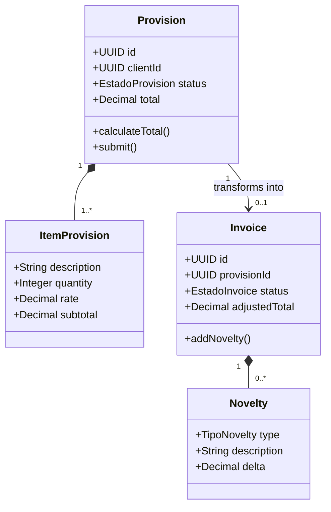
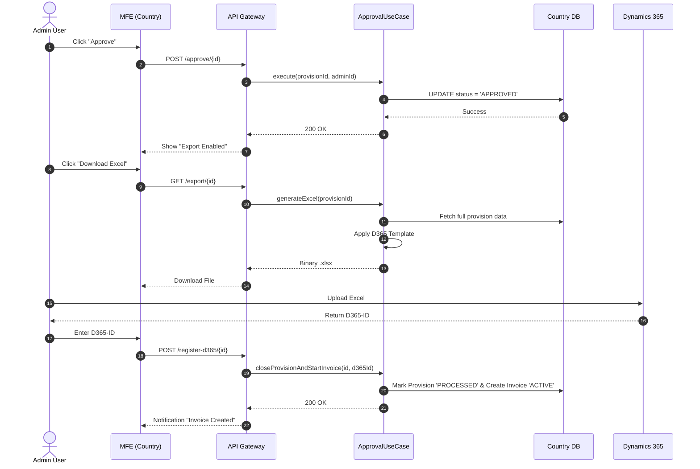
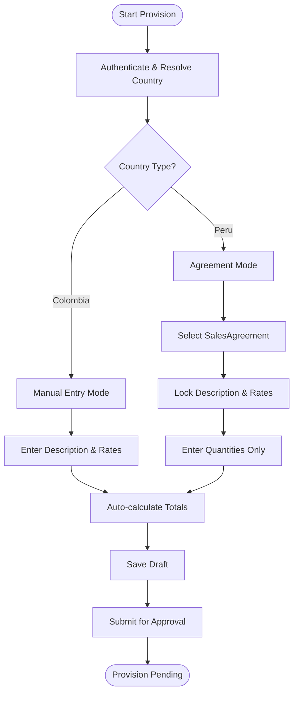
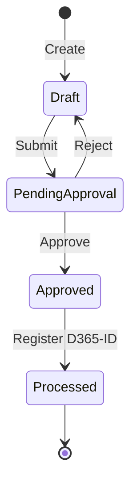

# Software Design Definition Document (SADD) — ISO/IEC/IEEE 12207:2017 (Clause 6.4.5)

## 1. Process Definition (ISO 24774)

| Element | Description |
| :--- | :--- |
| **Name** | **Proceso de Definición de Diseño para BillingTool** |
| **Purpose** | To transform the architectural baseline and system requirements into a detailed technical design, providing a definitive blueprint for the Construction process (Clause 6.4.7). It ensures that every component, interface, and data flow is specified to enable rapid, evolutionary development. |
| **Results** | 1. **Software Design Description (SDD):** Detailed logic and component specification.<br>2. **Interface Requirements Specification (IRS):** Detailed API and MFE contracts.<br>3. **Technical Models:** Class, Sequence, Activity, and State diagrams.<br>4. **Design Traceability Matrix:** Mapping from requirements $\rightarrow$ architecture $\rightarrow$ design. |
| **Notes** | Implementamos ISO/IEC/IEEE 12207 - 6.4.5 Definición de Diseño y ISO 24774 de forma genérica bajo estándares internacionales, optimizando la estructura para un modelo de **Entrega Evolutiva (Core SHELL First)** y **Rapid Development**. |
| **Inputs** | 1. `requirementENG.md` (SRS).<br>2. `architectureENG.md` (SADD/Architecture Baseline).<br>3. Corporate UI/UX Guidelines (TP). |
| **Outputs** | 1. `designENG.md` (Consolidated Design Doc).<br>2. OpenAPI/Swagger Specifications.<br>3. JSON Schemas for data exchange.<br>4. Component Design Library (shared-infra). |
| **Activities** | **A1: Detailed Component Design:** Specification of Shell and MFE internal modules.<br>**A2: Interface Specification:** Definition of REST contracts and Native Federation manifests.<br>**A3: Behavioral Modeling:** Creation of sequence and activity diagrams for critical use cases.<br>**A4: Data Design:** Definition of physical schemas and state transitions.<br>**A5: UI/UX Detailed Design:** Specification of common components and layout behavior. |
| **Controls** | **Ctrl-1:** Design Review against Architecture Baseline (Consistency check).<br>**Ctrl-2:** Interface Validation (Contract testing approach).<br>**Ctrl-3:** Complexity Analysis (Cognitive complexity limits for domain services). |
| **Constraints** | **C1: Framework Lock-in:** Design must remain decoupled from specific libraries in the Core Domain.<br>**C2: Multi-tenancy:** All design must account for physical data isolation per country.<br>**C3: Accessibility:** UI components must follow WCAG 2.1 standards. |

---

## 2. Software Design Description (SDD)

### 2.1. Design Strategy: Evolutionary Core, Component-Based UI & Hardened Security
Following the **Evolutionary Delivery** model, the design prioritizes the **Core Shell** as the foundational "rock" upon which the MFEs are mounted, implementing a **Zero-Trust Security model** from the ground up.

#### 2.1.1. Frontend Structural Design (Shell + MFEs)
The frontend is designed as a distributed system of autonomous applications orchestrated by a central host, utilizing **Angular**'s strict type system and security features.

**A. The Shell (Host Application):**
*   **Role:** Global Orchestrator.
*   **Core Services:**
    *   `AuthService`: Manages OAuth2 tokens and user profile claims.
    *   `FederationService`: Resolves `remoteEntry.json` and mounts MFEs dynamically.
    *   `LanguageService`: Global i18n/L10n handler for language switching (English/Spanish).
    *   `ThemeService`: Manages corporate branding and dark/light modes.
*   **Layout Design:**
    *   **Static Topbar (`inv-topbar`):** Fixed position. Contains:
        *   Global Search.
        *   Country Selector (triggers Shell route change).
        *   User Profile / Logout.
        *   Notification Bell.
    *   **Collapsible Sidebar:** Dynamic navigation based on the active MFE and user role (`ops`/`admin`).
    *   **Main Viewport:** Dynamic container where the active MFE is rendered.

**B. Remote MFEs (Colombia, Peru, etc.):**
*   **Role:** Domain-specific business logic.
*   **Internal Structure:**
    *   `Pages/`: Route-level components.
    *   `Features/`: Domain-specific components (e.g., `ProvisionGrid`, `InvoiceForm`).
    *   `State/`: Local state management using Angular Signals.
    *   `Services/`: API adapters calling the Backend Gateway.

**C. Shared Component Library (`shared-infra`):**
To ensure consistency, all MFEs and the Shell use a shared library of "Modern" components:
*   **Tables (`inv-table`):** Data-grid with built-in sorting, filtering, pagination, and "Excel-like" inline editing.
*   **Buttons (`inv-button`):** Standardized styles (Primary, Success, Danger, Ghost) with loading states.
*   **Dropdowns (`inv-select`):** Modern searchable selects with multi-select support and asynchronous loading.
*   **Modals (`inv-dialog`):** Standardized overlays for confirmations and detailed forms.
*   **Input Groups:** Validated fields with floating labels and real-time error feedback.

---

### 2.2. Backend Detailed Design (Hexagonal Implementation)

The backend transforms the architectural "Ports" into concrete implementations.

#### 2.2.1. Domain Logic (The Core)
Pure TypeScript/Java/Python classes implementing business rules:
*   `ProvisionCalculator`: Logic for $\Sigma(qty \times rate)$.
*   `InvoiceTransitionManager`: Validates the transition from `Approved Provision` $\rightarrow$ `Active Invoice`.
*   `NoveltyProcessor`: Logic for applying modifications to active invoices.

#### 2.2.2. Application Layer (Use Cases)
Orchestrators that handle the request-response cycle:
*   `CreateProvisionUseCase`: Validates input $\rightarrow$ Calls Domain $\rightarrow$ Saves via Repository Port.
*   `ApproveProvisionUseCase`: Validates role $\rightarrow$ Updates state $\rightarrow$ Triggers ERP Export event.

#### 2.2.3. Infrastructure Layer (Adapters)
*   **Persistence Adapter:** Implemented using **Django ORM**, leveraging its built-in protection against SQL Injection and its robust transaction management. It implements the `TenantRoutingDataSource` to switch DB connections based on the JWT `country` claim.
*   **ERP Adapter:** Implements the `.xlsx` generator according to the Dynamics 365 template.
*   **Security Adapter:** Implements the OIDC flow with Microsoft Entra ID and Google Workspace, utilizing **Django's security middleware** to enforce CSRF protection, secure cookies, and XSS prevention.

---

## 3. Interface Requirements Specification (IRS) & Security Hardening

### 3.1. Security Implementation (Impenetrable Layer)
To ensure enterprise-grade security, the following layers are implemented:

1.  **Transport Security:** Forced TLS 1.3 for all traffic. HSTS (HTTP Strict Transport Security) enabled.
2.  **Authentication & Authorization:** 
    *   OAuth 2.0 + PKCE.
    *   Stateless JWTs with short expiration and rotation.
    *   Claims-based RBAC verified at the API Gateway and re-verified at the Application layer (Double-check).
3.  **Application Hardening (Django + Angular):**
    *   **Django:** Mandatory use of `SECURE_SSL_REDIRECT`, `SESSION_COOKIE_SECURE`, and `CSRF_COOKIE_SECURE`.
    *   **Angular:** Strict usage of `DomSanitizer` to prevent XSS and strict Content Security Policy (CSP) headers.
4.  **Data Protection:** 
    *   AES-256 encryption for sensitive configuration data.
    *   Physical database isolation (DB-per-Tenant) ensuring zero cross-tenant data leakage.
5.  **Input/Output Validation:** 
    *   Strict JSON Schema validation for all API requests.
    *   Server-side sanitization of all data before storage or rendering.

### 3.2. Internal Interfaces (Shell $\leftrightarrow$ MFE)
Communication is handled via **Native Federation** (ES Modules) and a shared **State Bus**.

| Interface | Mechanism | Purpose | Data Exchanged |
| :--- | :--- | :--- | :--- |
| **MFE Mounting** | Native Federation | Load remote module | `remoteEntry.json`, JS Bundles |
| **Global State** | Shared Service / Signals | Sync user context | `UserContext { name, role, country, lang }` |
| **Navigation** | Angular Router | Route between MFEs | `url`, `queryParams` |

### 3.2. External Interfaces (MFE $\rightarrow$ Backend)
All communication is RESTful over HTTPS using JSON.

**API Contract Definition (OpenAPI/Swagger Snippet):**
```yaml
/api/v1/{country}/provision/{id}/submit:
  post:
    summary: Submit provision for approval
    parameters:
      - name: country
        in: path
        required: true
        schema: { type: string }
    responses:
      '200':
        description: Provision submitted successfully
        content:
          application/json:
            schema: { $ref: '#/components/schemas/SubmissionResponse' }
```

**JSON Schema for Novelty Registration:**
```json
{
  "$schema": "http://json-schema.org/draft-07/schema#",
  "type": "object",
  "properties": {
    "invoice_id": { "type": "string", "format": "uuid" },
    "novelties": {
      "type": "array",
      "items": {
        "type": "object",
        "properties": {
          "type": { "enum": ["add", "mod", "del"] },
          "item_id": { "type": "string", "format": "uuid" },
          "new_quantity": { "type": "number" }
        },
        "required": ["type", "item_id"]
      }
    }
  }
}
```

---

## 4. Technical Modeling & Diagrams

### 4.1. Class Diagram (Core Domain)
Focuses on the relationship between Provisioning and Invoicing.



### 4.2. Sequence Diagram: Provision Approval & ERP Sync
Detailed flow of the most critical business transaction.



### 4.3. Activity Diagram: Provisioning Flow (Manual vs Agreement)
Logic for different country operational models.



### 4.4. State Transition Diagram: Provision Lifecycle
Defines the legal states of a provision.



### 4.5. Internal Data Flow (DFD)
How data moves from the UI through the Hexagonal layers to the isolated DB.

`UI Event` $\rightarrow$ `MFE Service` $\rightarrow$ `API Gateway` $\rightarrow$ `Application UseCase` $\rightarrow$ `Domain Entity` $\rightarrow$ `Repository Adapter` $\rightarrow$ `Isolated SQL DB`.

---

## 5. Data Model & Interface Matrices

### 5.1. Physical Data Model Abstraction
While specific MFE tables are defined per country, the global structure follows:

**Global Schema:** `Users`, `Roles`, `GlobalParams`, `AuditLogs`.
**Country Schema (CO/PE):** `Clients`, `Provisions`, `ProvisionItems`, `Invoices`, `InvoiceNovelties`.

### 5.2. Design Traceability Matrix (DTM)
Maps requirements to design components.

| Req ID | Architectural Decision | Design Component | Validation |
| :--- | :--- | :--- | :--- |
| **FR-01** | MFE Per Country | `mfe-co` $\rightarrow$ `ManualEntryComponent` | UI Test |
| **FR-03** | MFE Per Country | `mfe-pe` $\rightarrow$ `AgreementSelectorComponent` | UI Test |
| **NFR-04** | DB-per-Tenant | `TenantRoutingDataSource` | Integration Test |
| **FR-18** | AI Integration | `NoveltyAIAdapter` $\rightarrow$ Gemini API | Accuracy Test |
| **FR-05** | Shell Layout | `shared-infra` $\rightarrow$ `TopbarComponent` | Visual Review |

### 5.3. Interface Definition Matrix

| Interface ID | Source | Target | Protocol | Frequency | Criticality |
| :--- | :--- | :--- | :--- | :--- | :--- |
| **INT-01** | Shell | MFE | ESM / Federation | Once per Load | High |
| **INT-02** | MFE | API Gateway | REST / JSON | Per Action | High |
| **INT-03** | Backend | Dynamics 365 | Excel / API | Monthly | Critical |
| **INT-04** | Backend | IdP (MS/Google) | OAuth2 / OIDC | Per Session | High |

---

## 6. Construction Readiness (Clause 6.4.7 Base)

To ensure "Building on Rock" (Rapid Development), the following are established:
1.  **Coding Standard:** TypeScript Strict Mode + ESLint (AirBnb).
2.  **Component Contract:** All `shared-infra` components must implement a common `BaseComponent` interface for consistent styling.
3.  **API First:** No frontend development starts until the OpenAPI spec for the corresponding endpoint is merged.
4.  **Robust Engineering Workflow:**
    *   **TDD (Test-Driven Development):** Write tests first for all Domain and Application services.
    *   **BDD (Behavior-Driven Development):** Implement Gherkin scenarios for all user-facing features in MFEs.
    *   **DDD (Domain-Driven Design):** Adhere to Bounded Contexts to ensure an impenetrable separation of domain logic.
    *   **Security-First:** Mandatory security review of any new API endpoint before implementation.
