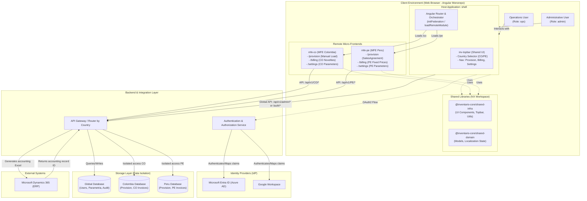
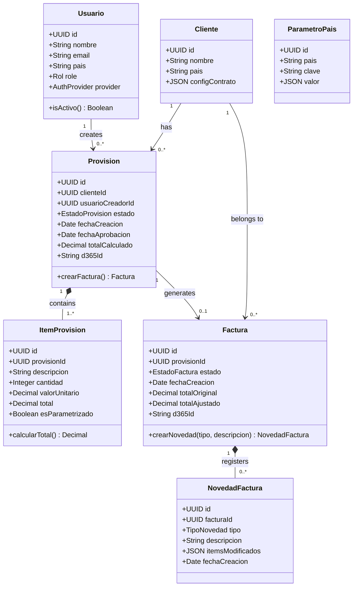
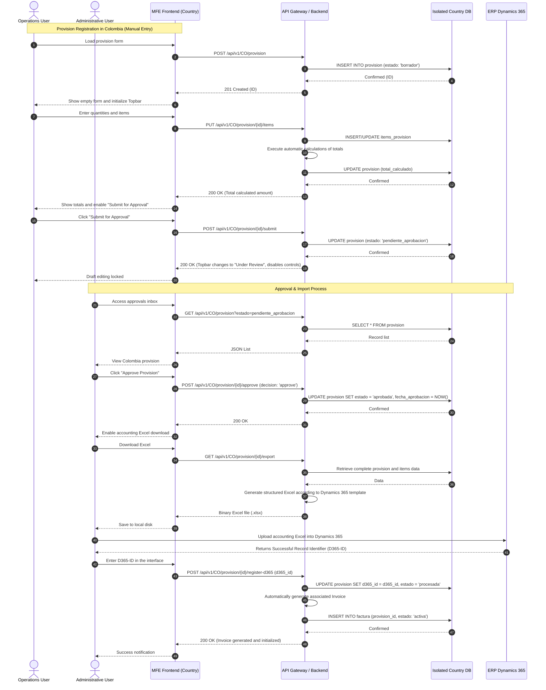
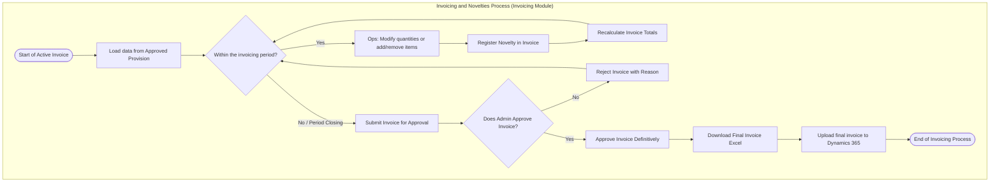

# System Requirements Specification and Definition — ISO/IEC/IEEE 12207:2017 (Clause 6.4.3)

This document unifies and refactors the requirements specifications for the **BillingTool** (Global Provisioning and Invoicing System) developed for the accounting team of TP (Teleperformance). The system automates the transition from provisioning to invoicing globally, mitigating the operational errors and risks of the current process based on shared spreadsheets and emails.

---

## 1. General Process Information

### 1.1. Process Attributes

| Attribute | Description |
| :--- | :--- |
| **Process Name** | System Requirements Definition Process |
| **Standard Reference** | ISO/IEC/IEEE 12207:2017 — Clause 6.4.3 (System Requirements Definition Process) |
| **Associated Project** | BillingTool — Global Provisioning and Invoicing System |
| **Main Client** | TP (Teleperformance) — Accounting Team |
| **Operational Scope** | Global (130+ countries with independent deployments and storage per country) |
| **Initial Phase** | Colombia (MFE-CO + DB-CO) and Peru (MFE-PE + DB-PE) |
| **Version / Status** | v2.0 — Consolidated Baseline |

### 1.2. Purpose of the Process
The purpose of this process is to define the requirements of the **BillingTool** system so that it provides the necessary capabilities and services that satisfy the client's needs (TP Accounting). This process translates business and operational expectations into structured, consistent, verifiable, and fully traceable technical requirements.

### 1.3. Process Outcomes

* **RK-01 (Defined Requirements):** The functional, non-functional, and quality boundaries of the system are defined based on local and global operations.
* **RK-02 (Defined Interface Architecture):** Internal interfaces (Micro Frontends - MFE) and external integrations (ERP Dynamics 365, corporate IdPs) are specified.
* **RK-03 (Established Traceability):** The Requirements Traceability Matrix (RTM) is implemented, linking business needs with system specifications.
* **RK-04 (Consistency and Feasibility):** Business and system models are validated with key stakeholders (Operations and Administrators).
* **RK-05 (Established Baseline):** The requirements baseline is established under a formal change control scheme.

---

## 2. Process Activities and Tasks (Compliance Checklist)

The following tables detail the process tasks and activities based on the ISO/IEC/IEEE 12207:2017 standard. These act as a checklist for project tracking.

### 2.1. Activity A: Prepare System Requirements Definition

| Task ID | Task | Description | Associated Deliverable | Status |
| :--- | :--- | :--- | :--- | :---: |
| **A.1** | Identify Stakeholders and Sources | Identify the system actors (Operations Users, Administrative Users) and requirements sources (interviews, sessions, manuals). | Stakeholders Registry | [ ] Pending |
| **A.2** | Analyze Business Needs | Analyze business flows (provisions, invoicing, roles, and multi-country) and the mitigation of errors from the spreadsheet-based model. | Business Vision Document | [ ] Pending |
| **A.3** | Define Gathering Strategy | Establish the mechanisms for compiling, analyzing, and prioritizing (MoSCoW) functional and non-functional requirements. | Requirements Strategy | [ ] Pending |
| **A.4** | Define Interface Requirements | Detail visual needs (fixed Topbar, collapsible Sidebar, and dynamic links bar according to process status). | UX/UI Specification | [ ] Pending |
| **A.5** | Define Data Requirements | Analyze data isolation requirements per country under TP's local regulations. | Data Isolation Strategy | [ ] Pending |

### 2.2. Activity B: Document and Model System Requirements

| Task ID | Task | Description | Associated Deliverable | Status |
| :--- | :--- | :--- | :--- | :---: |
| **B.1** | Write Specification (SRS) | Elaborate the System Requirements Specification (SRS) detailing the consolidated FR and NFR. | SRS (Section 3 of this Doc) | [ ] Pending |
| **B.2** | Elaborate Context Diagram | Design the level 0 context diagram / Mermaid detailing interactions with external entities. | Context Diagram (Section 3.1) | [ ] Pending |
| **B.3** | Elaborate Process Models | Design BPMN logical flows for the provisioning and invoicing with novelties processes. | BPMN Diagrams (Section 3.4) | [ ] Pending |
| **B.4** | Design UML Models | Build UML class and sequence diagrams to define technical and transitional interactions. | UML Diagrams (Section 3.3) | [ ] Pending |
| **B.5** | Define API Specifications | Define the REST endpoints catalog, input/output schemas, and API security mechanisms. | API Contracts (Section 3.2) | [ ] Pending |
| **B.6** | Design Use Cases | Detail use case diagrams and critical Use Case main flows. | Use Cases (Section 3.7.1) | [ ] Pending |
| **B.7** | Generate Traceability Matrix | Create and maintain the Requirements Traceability Matrix (RTM) with bidirectional mapping. | RTM Matrix (Section 3.8) | [ ] Pending |

### 2.3. Activity C: Evaluate and Validate System Requirements

| Task ID | Task | Description | Associated Deliverable | Status |
| :--- | :--- | :--- | :--- | :---: |
| **C.1** | Analyze IdP Feasibility | Evaluate the feasibility of migrating identity provider from Microsoft to Google Workspace transparently. | IdP Feasibility Analysis | [ ] Pending |
| **C.2** | Resolve Local Conflicts | Negotiate and document local business rule differences (e.g., manual calculations in Colombia vs. SalesAgreement with fixed prices in Peru). | Conflicts Resolution Minutes | [ ] Pending |
| **C.3** | Consistent Technical Review | Evaluate completeness, internal consistency, verifiability, and realism of the technical requirements. | Technical Review Minutes (QA) | [ ] Pending |
| **C.4** | Validation with Stakeholders | Present and verify requirements with TP Accounting, Operations, and Administrators. | Business Approval Minutes | [ ] Pending |

### 2.4. Activity D: Manage and Control Requirements (Maintenance)

| Task ID | Task | Description | Associated Deliverable | Status |
| :--- | :--- | :--- | :--- | :---: |
| **D.1** | Establish Baseline | Obtain formal approval signatures on the consolidated requirements document. | Approved Baseline | [ ] Pending |
| **D.2** | Manage Change Control | Register and evaluate change requests (RFC) in requirements, updating the RTM. | Change Control Log | [ ] Pending |

---

## 3. Process Deliverables

### 3.1. System Context Diagram

The following diagram illustrates the boundary of **BillingTool**, detailing external entities, the frontend architecture based on Angular Native Federation, the API Gateway, and the isolated storage systems.



#### Description of External Entities:
1. **Operations User (`ops`):** Responsible for loading provision data in draft, registering quantities, and recording novelties in local invoices through the corresponding MFEs.
2. **Administrative User (`admin`):** Responsible for evaluating approvals of provisions and invoices, configuring client parameters through the country's MFE, and performing management tasks via the Host UI.
3. **Microsoft Dynamics 365 (D365 ERP):** Centralizing corporate ERP that processes templates uploaded by administrators and returns the definitive accounting identifiers (`d365_id`).
4. **Corporate IdPs (Microsoft Entra ID / Google Workspace):** Identity providers that authenticate users and provide key claims such as country, role, and status.

### 3.1.1. Detailed Frontend Architecture (Angular & NX Monorepo)

The frontend of **BillingTool** is implemented on a monorepo managed by **NX**, structured into applications and reusable libraries under the following technical hierarchy:

#### 1. Applications (`apps/`)
* **`shell` (Host Application / Central Orchestrator):**
  * Configured with `@angular-architects/native-federation` to resolve and consume remote microfrontends dynamically.
  * Defines main global routes in `app.routes.ts` and dynamically mounts remote modules based on the selected country:
    * `/co`: Redirects and loads remote module `mfeCo` (`http://localhost:3002/remoteEntry.json`).
    * `/pe`: Redirects and loads remote module `mfePe` (`http://localhost:3001/remoteEntry.json`).
  * Uses the shared `TopbarComponent` from `@inventario-core/shared-infra/ui` to inject the fixed header and country selector in the global UI.
* **`mfe-co` (Remote Micro-Frontend Colombia):**
  * Exposes its internal routes (`/provision`, `/billing`, `/settings`) as a remote entry point (`./Routes`).
  * Implements local Colombian logic: manual entry of descriptions and manual calculations in the provision module.
* **`mfe-pe` (Remote Micro-Frontend Peru):**
  * Exposes its internal routes (`/provision`, `/billing`, `/settings`) as a remote entry point (`./Routes`).
  * Implements local Peruvian logic: mandatory consumption of pre-loaded *SalesAgreements* with fixed rates, locking manual entry of concepts and allowing only the input of operational quantities.

#### 2. Shared Libraries (`libs/`)
* **`shared-infra` (`@inventario-core/shared-infra`):**
  * **`ui/`**: Reusable visual components. Specifically `TopbarComponent` (`inv-topbar`), which detects the active route, injects dynamic links according to the context (`/co` or `/pe`), and renders the country selector to switch dynamically between remote microfrontends.
  * **`utils/`**: Global constants (e.g., system versions) and lifecycle helpers.
* **`shared-domain` (`@inventario-core/shared-domain`):**
  * Models localization states (`LocaleState`) including local currency (`COP` / `PEN`), date formats, and timezones (`America/Bogota` / `America/Lima`).

---

### 3.2. REST API Interface and Security Specifications

The API Gateway routes requests based on the transaction's country of origin parameter. All successful creation responses return code `201 Created`, and modified resources return `200 OK`.

#### 3.2.1. Unified Endpoint Catalog

| Module | Method | Endpoint | Input (Body) | Description |
| :--- | :--- | :--- | :--- | :--- |
| **Auth** | POST | `/api/v1/auth/login` or `/token` | `{ code, provider }` | Exchange OAuth2 code for JWT. |
| **Auth** | GET | `/api/v1/auth/me` | *None* | Returns role (`ops`/`admin`), assigned country, and profile. |
| **UI** | GET | `/api/v1/{pais}/ui/navigation-links` | *None* | Returns the dynamic links bar according to the current process state. |
| **Provision**| POST | `/api/v1/{pais}/provision` | `{ cliente_id, datos_adicionales }` | Creates an empty provision in `draft` status. |
| **Provision**| GET | `/api/v1/{pais}/provision/{id}` | *None* | Obtains details of a provision by ID. |
| **Provision**| PUT | `/api/v1/{pais}/provision/{id}/items` | `[ { descripcion, cantidad, valor_unitario } ]` | Registers/updates provision items and calculates totals. |
| **Provision**| POST | `/api/v1/{pais}/provision/{id}/submit` | *None* | Submits the provision to `pending_approval` status. |
| **Provision**| GET | `/api/v1/{pais}/provision` | *Filters (status, client)* | Lists provisions of the country. |
| **Provision**| POST | `/api/v1/{pais}/provision/{id}/approve` | `{ decision: 'approve'/'reject', comentario }` | Administrative action for approval or rejection. |
| **Provision**| GET | `/api/v1/{pais}/provision/{id}/export` | *None* | Downloads the structured Excel file to upload to Dynamics 365. |
| **Provision**| POST | `/api/v1/{pais}/provision/{id}/register-d365` | `{ d365_id }` | Registers the D365 ID, closing the provision and initiating the invoice. |
| **Invoicing**| GET | `/api/v1/{pais}/factura/{id}` | *None* | Obtains details of the invoice. |
| **Invoicing**| PUT | `/api/v1/{pais}/factura/{id}/novedades` | `[ { tipo: 'add'/'mod'/'del', item_id, cantidad, descripcion, valor_unitario } ]` | Registers item novelties during the active invoicing period. |
| **Invoicing**| POST | `/api/v1/{pais}/factura/{id}/submit` | *None* | Submits the adjusted invoice with novelties for administrative approval. |
| **Invoicing**| POST | `/api/v1/{pais}/factura/{id}/approve` | `{ decision: 'approve'/'reject', comentario }` | Administrative action for final invoice approval. |
| **Admin** | GET/POST/PUT | `/api/v1/admin/clientes` | Client Schema | CRUD operations on clients and their configurations. |
| **Admin** | GET/POST/PUT | `/api/v1/admin/parametros` | Country Parameters | CRUD operations on fixed rates and country items. |

#### 3.2.2. Authentication and Security
* **Mechanism:** OAuth 2.0 with OpenID Connect (OIDC).
* **Flow:** Authorization Code Flow + PKCE.
* **Supported Providers:** Microsoft Entra ID (Azure AD) and Google Workspace, encapsulated in a common abstraction layer on the backend.
* **JWT Attributes (Claims):** `{ name, email, country, role, groups }`.

#### 3.2.3. Data Schemas (JSON Schemas)

**Dynamic Navigation Response (`GET /api/v1/CO/ui/navigation-links`):**
```json
{
  "pais": "CO",
  "estado_proceso": "guardado_borrador",
  "links": [
    {
      "label": "Edit Provision Details",
      "url": "/provision/edit/123e4567-e89b-12d3-a456-426614174000",
      "visible": true,
      "color": "primary"
    },
    {
      "label": "Submit for Approval",
      "url": "/provision/submit/123e4567-e89b-12d3-a456-426614174000",
      "visible": true,
      "color": "success"
    },
    {
      "label": "Delete Draft",
      "url": "/provision/delete/123e4567-e89b-12d3-a456-426614174000",
      "visible": false,
      "color": "danger"
    }
  ]
}
```

**Invoice Novelty Registration (`PUT /api/v1/CO/factura/uuid-factura/novedades`):**
```json
{
  "comentarios": "Month-end adjustment due to overtime reduction requested by the client.",
  "novedades": [
    {
      "tipo_novedad": "mod",
      "item_id": "890f1234-a12b-34c5-d678-901234567890",
      "cantidad_anterior": 150,
      "cantidad_nueva": 120
    },
    {
      "tipo_novedad": "add",
      "descripcion": "Contingency support charge out of contract",
      "cantidad": 1,
      "valor_unitario": 450.00
    }
  ]
}
```

---

### 3.3. UML Diagrams

#### 3.3.1. System Class Diagram
The structural model details the key business entities and the logical relationship between the provision's lifecycle and the creation of the invoice.



#### 3.3.2. Sequence Diagram (Provision Transactional Flow)



---

### 3.4. BPMN Diagrams (Business Workflows)

#### 3.4.1. Provision Process Workflow

```mermaid
flowchart TD
    subgraph Provisioning["Provisioning Process (Provision Module)"]
        p_start([Start of Provision Period]) --> auth[OAuth2 MS/Google Authentication]
        auth --> check_country{Validate Country of Origin}
        
        check_country -->|Colombia| co_flow[MFE Colombia: Manual Configuration]
        check_country -->|Peru| pe_flow[MFE Peru: SalesAgreement Selection]
        check_country -->|Other Countries| global_flow[Generic MFE: Parameterized Load]
        
        %% Colombia Flow
        co_flow --> fill_co[Register client's base data]
        fill_co --> qty_co[Enter descriptions, values, and quantities]
        qty_co --> calc_co[Automatic calculation of accounting totals]
        
        %% Peru Flow
        pe_flow --> sel_pe[Select Client's SalesAgreement]
        sel_pe --> fixed_pe[Autocomplete items and agreed fixed rates]
        fixed_pe --> qty_pe[Enter operational quantities only]
        qty_pe --> calc_pe[Automatic calculation of accounting totals]
        
        calc_co --> save_draft[Save Provision Draft]
        calc_pe --> save_draft
        global_flow --> save_draft
        
        save_draft --> submit[Submit for Administrative Approval]
        submit --> check_role{Evaluate Role}
        
        check_role -->|Operations (Ops)| wait_approval[Lock editing / Change Topbar to 'Under Review']
        wait_approval --> admin_dec{Does Admin Approve?}
        
        admin_dec -->|No| reject_flow[Reject & Record Adjustment Comments]
        reject_flow --> save_draft
        
        admin_dec -->|Yes| approve_flow[Approve Provision & Enable Export]
        approve_flow --> download_excel[Admin downloads Excel file]
        download_excel --> upload_d365[Upload template to Dynamics 365]
        upload_d365 --> register_id[Register D365-ID in BillingTool]
        
        register_id --> auto_invoice[Automatic Creation of Invoice in 'Active' Status]
        auto_invoice --> p_end([End of Provision Phase])
    end
```

#### 3.4.2. Invoicing and Novelties Management Workflow



---

### 3.5. Multitenancy Strategy and Artificial Intelligence (LLM) Integration

#### 3.5.1. Data Isolation Strategy by Country (Multi-tenant)
To comply with local data storage regulations and corporate policies, an isolated multi-tenant data model is implemented:
* **Global Database:** Contains unified access credentials, role mappings, centralized audit logs, and global shared client configurations.
* **Local Databases (Isolated):** Each country (e.g., `DB_CO`, `DB_PE`) has its own physical database instance or independent schema, exclusively containing local records of provisions, items, invoices, and novelties of its operation.
*(Note: Internal physical structures and detailed tables are not specified in this process requirements document, as they form part of the detailed software architecture specifications).*

```
┌─────────────────────────────────────────────────────────────────┐
│                    GLOBAL DATABASE                              │
│  - Users (unified registry)                                     │
│  - Roles and permissions                                        │
│  - Global configuration                                         │
│  - Centralized audit                                            │
└─────────────────────────────────────────────────────────────────┘
                    │                    │                    │
         ┌──────────┘          ┌─────────┴─────────┐        └──────────┐
         ▼                     ▼                    ▼                   ▼
┌─────────────────┐  ┌─────────────────┐  ┌─────────────────┐  ┌───────────────┐
│  DB_COLOMBIA    │  │   DB_PERU       │  │   DB_OTRO_PAIS   │  │  DB_OTRO...   │
│ (Local logic)   │  │ (Local logic)   │  │ (Local logic)   │  │ (Local logic) │
└─────────────────┘  └─────────────────┘  └──────────────────┘  └───────────────┘
```

#### 3.5.2. Large Language Model (LLM) Use Cases in the Accounting Process
To improve efficiency and automate repetitive tasks, the following functionalities based on Large Language Model APIs (e.g., Google Gemini API) are incorporated:

1. **Intelligent Novelties Processor (Natural Language to JSON):**
   * *Description:* Allows operations users to copy and paste client emails, support meeting minutes, or informal notes into the interface. The LLM securely extracts the novelties (e.g., *"reduce 3 support agents and add 10 hours of consulting"*) and generates a structured JSON object to pre-load the novelties grid.
2. **Dynamics 365 Discrepancy Reconciler (AI Reconciliation):**
   * *Description:* After uploading the Excel template to D365, if an error or cent discrepancy is generated, the administrator uploads the D365 error report. The LLM compares the output file with system records, identifies rounding differences or wrong codes, and suggests the exact correction in natural language.
3. **Intelligent Local Fiscal Rules Mapper (Country Onboarding):**
   * *Description:* To facilitate scalability to 130+ countries, the global administrator uploads a PDF with the new country's tax and provisioning regulations. The LLM analyzes the tax requirements and generates the initialization JSON configurations adapted to local rules.
4. **Conversational Copilot for Global Audit (AI Analytics):**
   * *Description:* Integrated chat interface exclusively for central accounting administrators. Allows queries on global consolidated data (e.g., *"What percentage of provisions in Colombia have been converted to invoices this quarter compared to Peru?"*).

---

### 3.6. System Requirements Specification (SRS)

#### 3.6.1. Functional Requirements (FR)

| ID | Module | Description | Priority (MoSCoW) |
| :--- | :--- | :--- | :--- |
| **FR-01** | Provision | The system must allow the operations user to register provision data manually (Colombia). | Must Have |
| **FR-02** | Provision | The system must calculate totals automatically based on quantities and rates (`quantity × rate`). | Must Have |
| **FR-03** | Provision | The system must allow the selection of pre-loaded SalesAgreements with items and fixed rates (Peru). | Must Have |
| **FR-04** | Provision | In Peru, the system must lock item descriptions and rates, enabling only quantities editing. | Must Have |
| **FR-05** | UI | The user interface must feature a fixed Topbar and a collapsible Sidebar. | Should Have |
| **FR-06** | UI | The system must display a dynamic navigation link bar adapted to the provision/invoice status. | Should Have |
| **FR-07** | Approval | The system must restrict permissions: role `ops` creates and submits; role `admin` evaluates, approves, or rejects. | Must Have |
| **FR-08** | Provision | The system must generate and allow downloading a structured Excel file of the approved provision. | Must Have |
| **FR-09** | Integration | The system must allow the manual registration of the accounting identifier (D365-ID) returned by Dynamics 365. | Must Have |
| **FR-10** | Invoicing | The approved provision must automatically convert into an Invoice in `active` status after registering the D365-ID. | Must Have |
| **FR-11** | Invoicing | The system must allow adding, modifying, and reducing invoice items (novelties) during the active period. | Must Have |
| **FR-12** | Invoicing | Any modification in the active invoice must be recorded as a novelty in a log history (`novedades_factura`). | Must Have |
| **FR-13** | Admin | The administrative module must allow configuring clients, fixed rates, and rules per country. | Must Have |
| **FR-14** | Auth | Users must authenticate via OAuth2 using corporate credentials. | Must Have |
| **FR-15** | Auth | The backend must redirect the user to the Micro Frontend (MFE) and isolated DB of their country according to IdP claims. | Must Have |
| **FR-16** | Provision | The system must allow saving provisions in "Draft" status and resuming editing later. | Must Have |
| **FR-17** | Invoicing | The system must allow exporting the final invoice to Excel format for Dynamics 365 after approval. | Must Have |
| **FR-18** | LLM | The system must provide an interface to parse novelties from informal text using AI. | Should Have |
| **FR-19** | LLM | The system must analyze Dynamics 365 error reports and propose discrepancy solutions using AI. | Should Have |
| **FR-20** | LLM | The system must process tax regulation PDFs of new countries and generate base parameters using AI. | Should Have |
| **FR-21** | LLM | The system must provide a global audit chat bot with access to consolidated queries for administrators. | Could Have |

#### 3.6.2. Non-Functional Requirements (NFR)

| ID | Category | Description / Acceptance Metric | Priority (MoSCoW) |
| :--- | :--- | :--- | :--- |
| **NFR-01** | Scalability | Physical/logical multi-tenant architecture to support quick deployments in more than 130 countries. | Must Have |
| **NFR-02** | Performance | On-screen total calculations in less than 1 second; API responses under 2 seconds. | Should Have |
| **NFR-03** | Portability | Abstracted authentication with OAuth2 to allow transparent migration from Microsoft Entra ID to Google Workspace. | Must Have |
| **NFR-04** | Security | Physical data isolation of databases per country. No local script/API must read other countries' data. | Must Have |
| **NFR-05** | Security | Role-Based Access Control (RBAC) validated on each request and endpoint of the API Gateway. | Must Have |
| **NFR-06** | Auditability | Immutable audit log for every action of approval, export, and manual import to Dynamics 365. | Must Have |
| **NFR-07** | Availability | The system must guarantee 99.5% availability during TP's accounting working hours. | Should Have |
| **NFR-08** | Maintainability | Architecture based on Micro Frontends (MFE) per country for independent deployments without global downtime. | Should Have |
| **NFR-09** | Integrity | Local database operations must comply with ACID properties (Transactional Consistency). | Must Have |
| **NFR-10** | Usability | Consistency of visual UX design, guaranteeing ease of use and adaptability to standard resolutions. | Should Have |
| **NFR-11** | Hardened Security | **Impenetrable Security Baseline:** Implementation of Zero-Trust Architecture, end-to-end encryption (TLS 1.3), and strict input sanitization to prevent OWASP Top 10 vulnerabilities. | Must Have |
| **NFR-12** | Quality Assurance | **Robust Engineering:** Mandatory implementation of Test-Driven Development (TDD), Behavior-Driven Development (BDD), and Domain-Driven Design (DDD) to ensure architectural integrity. | Must Have |

---

### 3.7. Use Case Models and Business Rules

#### 3.7.1. Critical Use Case Modeling

```
┌─────────────────────────────────────────────────────────────────┐
│                      BILLINGTOOL SYSTEM                          │
│                                                                  │
│  ┌─────────────────────────────────────────────────────────┐    │
│  │               PROVISION MODULE                           │    │
│  │  ┌──────────────────────────────────────────────────┐   │    │
│  │  │ CU-01: Register Provision Data                   │   │    │
│  │  │ CU-02: Save Provision (Draft)                     │   │    │
│  │  │ CU-03: Calculate Totales                          │   │    │
│  │  │ CU-04: Submit for Approval                       │   │    │
│  │  │ CU-05: Register Manual Items (CO)                │   │    │
│  │  │ CU-06: Select SalesAgreement (PE)                │   │    │
│  │  └──────────────────────────────────────────────────┘   │    │
│  └─────────────────────────────────────────────────────────┘    │
│                                                                  │
│  ┌─────────────────────────────────────────────────────────┐    │
│  │               INVOICING MODULE                           │    │
│  │  ┌──────────────────────────────────────────────────┐   │    │
│  │  │ CU-07: View Invoice (from Approved Prov.)        │   │    │
│  │  │ CU-08: Register Novelty in Invoice               │   │    │
│  │  │ CU-09: Submit Invoice for Approval               │   │    │
│  │  └──────────────────────────────────────────────────┘   │    │
│  └─────────────────────────────────────────────────────────┘    │
│                                                                  │
│  ┌─────────────────────────────────────────────────────────┐    │
│  │               ADMINISTRATIVE MODULE                      │    │
│  │  ┌──────────────────────────────────────────────────┐   │    │
│  │  │ CU-10: Approve/Reject Provision                  │   │    │
│  │  │ CU-11: Approve/Reject Invoice                    │   │    │
│  │  │ CU-12: Download Excel and Upload to D365         │   │    │
│  │  │ CU-13: Manage Clients                            │   │    │
│  │  │ CU-14: Manage Parameters                         │   │    │
│  │  │ CU-15: Register Dynamics 365 ID                  │   │    │
│  │  └──────────────────────────────────────────────────┘   │    │
│  └─────────────────────────────────────────────────────────┘    │
│                                                                  │
│  ┌─────────────────────────────────────────────────────────┐    │
│  │               COMMON MODULE                              │    │
│  │  ┌──────────────────────────────────────────────────┐   │    │
│  │  │ CU-16: Log In (OAuth MS/Google)                  │   │    │
│  │  │ CU-17: Navigate via Dynamic Links                │   │    │
│  │  │ CU-18: Manage Sidebar / Topbar                   │   │    │
│  │  └──────────────────────────────────────────────────┘   │    │
│  └─────────────────────────────────────────────────────────┘    │
│                                                                  │
│  ┌───────────┐           ┌──────────────────┐                   │
│  │Operations │◄─────────►│    Admin User    │                   │
│  │   User    │           │  (Administrative)│                   │
│  │  (ops)    │           │     (admin)      │                   │
│  └───────────┘           └──────────────────┘                   │
└─────────────────────────────────────────────────────────────────┘
```

**CU-01: Register Provision Data**
* **Primary Actor:** Operations User (`ops`).
* **Precondition:** User logged into the corresponding country's MFE.
* **Main Flow:**
  1. The user accesses the "Create Provision" form.
  2. The system displays the empty revenue grid and the dynamic topbar in "New" status.
  3. The user records the service description, unit value, and quantity manually (Colombia Flow).
  4. The system executes `CU-03: Calculate Totals`.
  5. The user clicks "Save Draft".
* **Alternative Flow (Peru):**
  1. The system executes `CU-06: Select SalesAgreement`.
  2. The system locks item descriptions and rates, enabling only the quantities field.
  3. The user enters the quantities.
  4. The automatic calculation of totals is executed, and the draft is saved.

**CU-08: Register Novelty in Invoice**
* **Primary Actor:** Operations User (`ops`).
* **Precondition:** Invoice in `active` status generated after registering the provision's D365-ID.
* **Main Flow:**
  1. The user searches for the active invoice and selects "Add Novelty".
  2. The system requests the novelty type (addition, modification, or deletion) and the justification.
  3. The user enters the modified data.
  4. The system records the history in the local novelties database and executes the recalculation of the invoice's adjusted total.
  5. The topbar updates the dynamic links, enabling "Submit for Approval".

---

#### 3.7.2. Business Rules (BR)

* **BR-01 (Segregation of Duties):** The role `ops` does not have permissions under any circumstances to approve, reject, or force export to Dynamics 365. The role `admin` cannot initialize or modify provisions or register novelties directly (must reject them so `ops` can make changes).
* **BR-02 (Traceability and Dynamic Conversion):** An approved provision can only transition to `processed` status and generate an `active` invoice when the administrator registers a non-null and non-empty `d365_id` in the system.
* **BR-03 (Price Consistency in Peru):** Item values and rates in Peru are strictly non-editable by the user. They come directly from the administrative contracts configuration (`config_contrato` / `SalesAgreement`).
* **BR-04 (Closed Period):** No invoicing novelty can be registered after the invoice has been submitted for final approval by operations (`pending_approval`).
* **BR-05 (Country Isolation):** Data from one country is neither visible nor accessible from another country's APIs at the transactional level.
* **BR-06 (Automatic Calculation):** The total of provision/invoice is automatically calculated on the backend and frontend as `Σ(quantity × unit_value)` of all added items.
* **BR-07 (Parameterization by Country):** Each country defines its own base rates and specific item rules (e.g., fixed items in Peru vs. manual items in Colombia).
* **BR-08 (Restrictive Export):** Only provisions and invoices that are in `approved` status can be exported to Dynamics 365 by the admin user.
* **BR-09 (Authentication and Country Identification):** The unified corporate login provides the user's default role and country from identity metadata (JWT Claims).
* **BR-10 (IdP Transparency):** The system must function transparently and equivalently whether the identity provider is Microsoft Entra ID or Google Workspace.

---

### 3.8. Requirements Traceability Matrix (RTM)

The following matrix establishes bidirectional traceability between the client need statements (defined in the original requirements lines) and the technical specifications described in this document.

| Client Line ID | Client Need (Summary) | Functional Req (FR) | Non-Functional Req (NFR) | UML Use Case | Business Rule |
| :--- | :--- | :--- | :--- | :--- | :--- |
| **L-01** | Consolidate provisions and invoicing to mitigate spreadsheet human errors. | FR-08, FR-10, FR-17 | NFR-06 (Auditability), NFR-09 | CU-02, CU-07, CU-12, CU-15 | BR-02 |
| **L-03** | Multi-tenant architecture for 130+ countries with independent DBs and frontends. | FR-15 (MFE Redirect) | NFR-01 (Scalability), NFR-04 (Isolation) | CU-16 (Login) | BR-05 |
| **L-05** | Colombia uses manual Excel formats; Peru uses SalesAgreements with fixed prices. | FR-01, FR-02, FR-03, FR-04 | NFR-02 (Performance) | CU-01, CU-03, CU-05, CU-06 | BR-03, BR-06, BR-07 |
| **L-07** | Fixed topbar, collapsible sidebar, and dynamic links bar based on status. | FR-05, FR-06 | NFR-10 (Usability), NFR-08 | CU-17, CU-18 | *N/A* |
| **L-09** | Approval by admin, Excel download, upload to D365, and auto invoice start. | FR-07, FR-08, FR-09, FR-10 | NFR-05 (RBAC), NFR-06 | CU-04, CU-10, CU-12, CU-15 | BR-01, BR-02, BR-08 |
| **L-11** | Highly similar invoicing module; allows novelties in items/quantities and approval. | FR-11, FR-12, FR-17 | NFR-06 (Auditability) | CU-08, CU-09, CU-11 | BR-04 |
| **L-13** | Exclusive admin module for client creation, configuration, downloads, and uploads. | FR-07, FR-13 | NFR-05 (RBAC) | CU-13, CU-14, CU-12 | BR-01 |
| **L-15** | Global scalability, robustness, and processing agility. | FR-02 (Calculations) | NFR-01 (Growth), NFR-02 (Performance) | CU-03 (Calculation) | BR-06 |
| **L-17** | Corporate login Microsoft/Google in migration process. | FR-14, FR-15 | NFR-03 (IdP Portability) | CU-16 (Login) | BR-09, BR-10 |

---

## 4. Glossary of Terms

* **BillingTool:** Unified web system for decentralized provisioning and invoicing at Teleperformance.
* **MFE (Micro Frontend):** Web architecture strategy where the frontend is divided into autonomous and independent sub-applications per country.
* **Provision:** Estimated accounting entry representing a claim right prior to the issue of the legal invoice.
* **Novelty:** Modification in quantities, descriptions, or amounts on an invoice in its active adjustment period.
* **Dynamics 365 (D365):** Microsoft corporate ERP where Teleperformance official accounting is consolidated.
* **SalesAgreement (Sales Agreement):** Pre-parameterized commercial contract in Peru containing fixed, read-only prices and concepts.
* **d365_id:** Identifier returned by Dynamics 365 after successful upload of the provision/invoice. Closes the provision cycle and starts the invoicing cycle.
* **OAuth2 / OIDC:** Open-standard authentication protocols used for corporate login with Microsoft and Google accounts.
* **RBAC (Role-Based Access Control):** Role-based access control to restrict operations to users based on their role (`ops` or `admin`).

---

## 5. Approval and Change Control

Establishing the Requirements Baseline requires the signatures of the following key roles before starting detailed design and coding:

| Role | Name & Title | Review Date | Approval Signature |
| :--- | :--- | :--- | :--- |
| **Requirements Analyst** | *TBD* | | |
| **Accounting Manager (TP)** | *TBD* | | |
| **Architecture Lead** | *TBD* | | |
| **Project Manager (PM)** | *TBD* | | |
